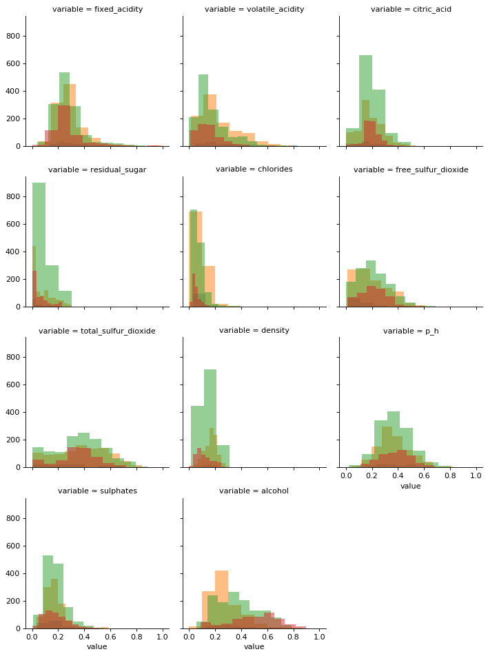

# Machine Learning in Python - Project 2

Due Wednesday, April 15th by 5 pm.

## 1. Setup

### 1.1 Libraries


```python
# Add any additional libraries or submodules below

# Display plots inline
%matplotlib inline

# Data libraries
import pandas as pd
import numpy as np

# Plotting libraries
import matplotlib.pyplot as plt
import seaborn as sns

# Plotting defaults
plt.rcParams['figure.figsize'] = (8,5)
plt.rcParams['figure.dpi'] = 80

# ipython interactive widgets
from ipywidgets import interact

# sklearn modules
import sklearn
from sklearn import metrics
from sklearn import preprocessing
from sklearn.pipeline import make_pipeline
from sklearn.metrics import confusion_matrix, classification_report
from sklearn.preprocessing import StandardScaler, LabelEncoder
from sklearn.ensemble import RandomForestClassifier
from sklearn.linear_model import LogisticRegression
from sklearn.preprocessing import PolynomialFeatures
from sklearn.svm import SVC
from sklearn.model_selection import GridSearchCV, KFold
from sklearn.linear_model import LogisticRegression
```

### 1.2 Data


```python
wine_train = pd.read_csv("wine_qual_train.csv")
wine_test  = pd.read_csv("wine_qual_test.csv")
```

## 2. Exploratory Data Analysis and Preprocessing

*Include a discussion of the data with a particular emphasis on the features of the data that are relevant for the subsequent modeling. Including visualizations of the data is strongly encouraged - all code and plots must also be described in the write up.*

*In this section you should also implement and describe any preprocessing / transformations of the features. Hint - you need to take care of the discretization of the `quality` variable as described in `README.ipynb`.*

### Transform `quality` into category variable


```python
wine_train = pd.get_dummies(wine_train)
wine_test = pd.get_dummies(wine_test)
```


```python
#transform quality into quality category
bin_edges=[0,4,5,6,10]
bin_names=['Poor','Average','Good','Excellent']
wine_train['quality']=pd.cut(wine_train['quality'], bin_edges, labels=bin_names)
wine_test['quality']=pd.cut(wine_test['quality'], bin_edges, labels=bin_names)
```

---
### 2.1 Exploratory Analysis


```python
#define a function to scaled varaibles to plot histagrams
scaler = preprocessing.MinMaxScaler()
min_max_scaler = preprocessing.MinMaxScaler()

def scaleColumns(df, cols_to_scale):
    for col in cols_to_scale:
        df[col] = pd.DataFrame(min_max_scaler.fit_transform(pd.DataFrame(wine_train[col])),columns=[col])
    return df

#scale the train set
wine_trainscaled = scaleColumns(wine_train,wine_train.columns[1:12])
```

Histagram of each covariates are as follow.

According to histgram, there are obvious overlaps of different quality in `fixed_acidity` and `volatile_acidity`, Besides,`fixed_acidity`,`volatile_acidity`,`residual_sugar` and `chlorides` are right skewed.


```python
#histagram for each covariates,different color represents different quality
df = pd.melt(wine_trainscaled, wine_trainscaled.columns[0], wine_trainscaled.columns[1:12])
g = sns.FacetGrid(df, col="variable", hue="quality", col_wrap=3)
g.map(plt.hist, "value", alpha=0.5)
plt.show()
```





---
Summary statistics of covariates are as follow:

According to median and Mean each covariates:`fixed_acidity`,`volatile_acidity`,`residual_sugar` and `chlorides` are  right skewed since their mean is greater than corresponding median.This is because they have extrme maximun.
According to sd:`residual_sugar`,`chlorides`,`volatile_acidity`	,`citric_acid`,`free_sulfur_dioxide`,`total_sulfur_dioxide` have large sd. 


```python
wine_train.iloc[:,range(11)].describe()#summary continuious covariates
```


<div>
<style scoped>
    .dataframe tbody tr th:only-of-type {
        vertical-align: middle;
    }

    .dataframe tbody tr th {
        vertical-align: top;
    }

    .dataframe thead th {
        text-align: right;
    }
</style>
<table border="1" class="dataframe">
  <thead>
    <tr style="text-align: right;">
      <th></th>
      <th>fixed_acidity</th>
      <th>volatile_acidity</th>
      <th>citric_acid</th>
      <th>residual_sugar</th>
      <th>chlorides</th>
      <th>free_sulfur_dioxide</th>
      <th>total_sulfur_dioxide</th>
      <th>density</th>
      <th>p_h</th>
      <th>sulphates</th>
    </tr>
  </thead>
  <tbody>
    <tr>
      <td>count</td>
      <td>3000.000000</td>
      <td>3000.000000</td>
      <td>3000.000000</td>
      <td>3000.000000</td>
      <td>3000.000000</td>
      <td>3000.000000</td>
      <td>3000.000000</td>
      <td>3000.000000</td>
      <td>3000.000000</td>
      <td>3000.000000</td>
    </tr>
    <tr>
      <td>mean</td>
      <td>7.227633</td>
      <td>0.340667</td>
      <td>0.319857</td>
      <td>5.543033</td>
      <td>0.056370</td>
      <td>30.894833</td>
      <td>115.797500</td>
      <td>0.994740</td>
      <td>3.215623</td>
      <td>0.530207</td>
    </tr>
    <tr>
      <td>std</td>
      <td>1.309546</td>
      <td>0.163205</td>
      <td>0.147306</td>
      <td>4.851228</td>
      <td>0.034987</td>
      <td>17.871765</td>
      <td>56.847462</td>
      <td>0.003071</td>
      <td>0.159478</td>
      <td>0.143235</td>
    </tr>
    <tr>
      <td>min</td>
      <td>3.900000</td>
      <td>0.105000</td>
      <td>0.000000</td>
      <td>0.600000</td>
      <td>0.009000</td>
      <td>1.000000</td>
      <td>6.000000</td>
      <td>0.987110</td>
      <td>2.740000</td>
      <td>0.220000</td>
    </tr>
    <tr>
      <td>25%</td>
      <td>6.400000</td>
      <td>0.230000</td>
      <td>0.250000</td>
      <td>1.800000</td>
      <td>0.038000</td>
      <td>17.000000</td>
      <td>76.000000</td>
      <td>0.992340</td>
      <td>3.110000</td>
      <td>0.430000</td>
    </tr>
    <tr>
      <td>50%</td>
      <td>7.000000</td>
      <td>0.290000</td>
      <td>0.310000</td>
      <td>3.050000</td>
      <td>0.048000</td>
      <td>29.000000</td>
      <td>118.000000</td>
      <td>0.994980</td>
      <td>3.200000</td>
      <td>0.510000</td>
    </tr>
    <tr>
      <td>75%</td>
      <td>7.700000</td>
      <td>0.410000</td>
      <td>0.400000</td>
      <td>8.200000</td>
      <td>0.066000</td>
      <td>42.000000</td>
      <td>156.000000</td>
      <td>0.997000</td>
      <td>3.320000</td>
      <td>0.600000</td>
    </tr>
    <tr>
      <td>max</td>
      <td>15.900000</td>
      <td>1.330000</td>
      <td>1.660000</td>
      <td>65.800000</td>
      <td>0.611000</td>
      <td>146.500000</td>
      <td>307.500000</td>
      <td>1.038980</td>
      <td>4.010000</td>
      <td>2.000000</td>
    </tr>
  </tbody>
</table>
</div>


---
Corresponding to results in statistics summary df for each covariates, I drawed violin plots to those right skewed variables, violin plots clearly show that `fixed_acidity`,`volatile_acidity`,`residual_sugar` and `chlorides` are slightly right skewed. I need
 to logrithmn these variables if I want to apply models with normality assumption.


```python
plt.figure(figsize=(25,8))

plt.subplot(131)
sns.violinplot(y='fixed_acidity', x='quality', data=wine_train)

plt.subplot(132)
sns.violinplot(y='volatile_acidity', x='quality', data=wine_train)#right skewed

plt.show()
```


```python
plt.figure(figsize=(25,8))

plt.subplot(131)
sns.violinplot(y='residual_sugar', x='quality', data=wine_train)

plt.subplot(132)
sns.violinplot(y='chlorides', x='quality', data=wine_train)

plt.show()
```


Take `fixed_acidity` as an example, after logrithm, points in striplot and subplot are symmetric distributed and violin plot shows a realtively symmetric density.


```python
#define datasets logrithmn right skewed variables
wine_trainlog = wine_train.copy()

wine_trainlog['log_fixed_acidity'] = np.log(wine_trainlog.fixed_acidity)
wine_trainlog['log_volatile_acidity'] = np.log(wine_trainlog.volatile_acidity)
wine_trainlog['log_residual_sugar'] = np.log(wine_trainlog.residual_sugar)
wine_trainlog['log_chlorides'] = np.log(wine_trainlog.chlorides)
```


```python
#one of right skewed variable after being logrithmn
plt.figure(figsize=(12,6))

plt.subplot(131)
sns.stripplot(y='log_fixed_acidity', x='quality', data=wine_trainlog)

plt.subplot(132)
sns.swarmplot(y='log_fixed_acidity', x='quality', data=wine_trainlog)

plt.subplot(133)
sns.violinplot(y='log_fixed_acidity', x='quality', data=wine_trainlog)

plt.show()
```


---
Collinearity check:

dataframe as follow are pairs of covariates which have correlation absolute value greater than 0.5, I should delete `total_sulfur_dioxide`,`wine_red`,`wine_white` and `density` based on threshold = 0.6 if I decide to fix collinearity.


```python
corr_df = wine_train.corr()
corr_df = corr_df.where(np.triu(np.ones(corr_df.shape)).astype(np.bool))

corr_df = corr_df.stack().reset_index()
corr_df.columns = ['Row','Column','Value']
arr = np.where((abs(corr_df['Value'])>0.5) & (abs(corr_df['Value'])<1))[0]
corr_df.iloc[arr.tolist(),]
```


<div>
<style scoped>
    .dataframe tbody tr th:only-of-type {
        vertical-align: middle;
    }

    .dataframe tbody tr th {
        vertical-align: top;
    }

    .dataframe thead th {
        text-align: right;
    }
</style>
<table border="1" class="dataframe">
  <thead>
    <tr style="text-align: right;">
      <th></th>
      <th>Row</th>
      <th>Column</th>
      <th>Value</th>
    </tr>
  </thead>
  <tbody>
    <tr>
      <td>25</td>
      <td>fixed_acidity</td>
      <td>wine_red</td>
      <td>0.504576</td>
    </tr>
    <tr>
      <td>26</td>
      <td>fixed_acidity</td>
      <td>wine_white</td>
      <td>-0.504576</td>
    </tr>
    <tr>
      <td>37</td>
      <td>volatile_acidity</td>
      <td>wine_red</td>
      <td>0.663968</td>
    </tr>
    <tr>
      <td>38</td>
      <td>volatile_acidity</td>
      <td>wine_white</td>
      <td>-0.663968</td>
    </tr>
    <tr>
      <td>53</td>
      <td>residual_sugar</td>
      <td>total_sulfur_dioxide</td>
      <td>0.503762</td>
    </tr>
    <tr>
      <td>54</td>
      <td>residual_sugar</td>
      <td>density</td>
      <td>0.565372</td>
    </tr>
    <tr>
      <td>67</td>
      <td>chlorides</td>
      <td>wine_red</td>
      <td>0.511877</td>
    </tr>
    <tr>
      <td>68</td>
      <td>chlorides</td>
      <td>wine_white</td>
      <td>-0.511877</td>
    </tr>
    <tr>
      <td>70</td>
      <td>free_sulfur_dioxide</td>
      <td>total_sulfur_dioxide</td>
      <td>0.728857</td>
    </tr>
    <tr>
      <td>82</td>
      <td>total_sulfur_dioxide</td>
      <td>wine_red</td>
      <td>-0.710038</td>
    </tr>
    <tr>
      <td>83</td>
      <td>total_sulfur_dioxide</td>
      <td>wine_white</td>
      <td>0.710038</td>
    </tr>
    <tr>
      <td>87</td>
      <td>density</td>
      <td>alcohol</td>
      <td>-0.678953</td>
    </tr>
  </tbody>
</table>
</div>


---
Based on what have been discussed afore, I defined datasets which both logrithmn right skewed variables and delete collinear variables, so that model required normality and no collinerity canbe applied to them.


```python
wine_trainlogcolli = wine_train.copy()
wine_trainlogcolli.drop(['total_sulfur_dioxide','wine_red','wine_white','density'],axis=1)
wine_trainlogcolli['log_fixed_acidity'] = np.log(wine_trainlogcolli.fixed_acidity)
wine_trainlogcolli['log_volatile_acidity'] = np.log(wine_trainlogcolli.volatile_acidity)
wine_trainlogcolli['log_residual_sugar'] = np.log(wine_trainlogcolli.residual_sugar)
wine_trainlogcolli['log_chlorides'] = np.log(wine_trainlogcolli.chlorides)

wine_testlogcolli = wine_test.copy()
wine_testlogcolli.drop(['total_sulfur_dioxide','wine_red','wine_white','density'],axis=1)
wine_testlogcolli['log_fixed_acidity'] = np.log(wine_testlogcolli.fixed_acidity)
wine_testlogcolli['log_volatile_acidity'] = np.log(wine_testlogcolli.volatile_acidity)
wine_testlogcolli['log_residual_sugar'] = np.log(wine_testlogcolli.residual_sugar)
wine_testlogcolli['log_chlorides'] = np.log(wine_testlogcolli.chlorides)
```


```python
#Split preprocessed datasets into design marix and dependent variable.

X_trainlogcolli = wine_trainlogcolli.drop('quality', axis=1)
X_train = wine_train.drop('quality', axis=1)
y_train = wine_train.quality

X_testlogcolli = wine_testlogcolli.drop('quality', axis=1)
X_test = wine_test.drop('quality', axis=1)
y_test = wine_test.quality
```

## 3. Model Fitting and Tuning

*Logistic Regression and SVC are tried, by comparing accuracy and f1-score, I finally choose Random Forest Classifier.  The highest accuracy of Logistic regression is 0.567, SVM is 0.62, and Random forest is 0.65.*

*In order to tune the Random Forest model, at the begining I used a interact to explore the probable "best" interval of `n_estimators` and `max_depth`, I found that `n_estimators` between 10-100 with `max_depth` between 10-40 could actually  obtain a relatively good accuracy, base on those interval I carried out cross validation and found the best parameter combination is: {'criterion': 'entropy', 'max_depth': 15, 'n_estimators': 110}. I also notice that becuse there are less sample of `quality` == "Poor",which means sample are not balanced,this is perhaps another reason why Random Forests performs better. In addition, there are outliers in dataset but Random Forest is not sensitive to them.*

*The reason why I reject logistic regression is that, it's hard to deal with interaction between variables and most varaibles seems aren't linearly associated with log odds , also, the prediction performance is the worst among three models I've tried. As for SVC, it havs a close accuracy to Random Forest, but during cross validation to tune this model, it took so much time to find a suitable set of parameter and as I increase the value of parameter c for a better accuracy, this may result in overfitting. However, Random Forest can deal with problems mention afore, this is probably the reason why accuracy of Random Forest in default set is even better than tuned SVC.*

---
### Random Forests Classifier

### 3.1 Fit a random forest


```python
@interact(n_estimators = (10,300), max_depth=[None] + list(np.arange(1,70,5)))

def fit_rf(n_estimators, max_depth):
    m_rf = sklearn.ensemble.RandomForestClassifier(
        n_estimators=n_estimators, max_depth=max_depth
    ).fit(X_train,y_train)
    
    res = wine_test.copy()
    res["pred_label"] = m_rf.predict(X_test)
    
    
    print(
        sklearn.metrics.classification_report(y_test, res.pred_label)
    )
```


    interactive(children=(IntSlider(value=155, description='n_estimators', max=300, min=10), Dropdown(description=…


```python
# find the best parameter setting by cross validation

parameters = {
    'n_estimators': list(np.arange(10,200,10)),
    'max_depth': list(np.arange(15,40,5)),
    'criterion': ['entropy', 'gini']
}

m_rf = RandomForestClassifier(random_state=1, n_jobs=-1)
cvrf = GridSearchCV(m_rf, param_grid=parameters,cv=KFold(5, False, random_state=1))
cvrf.fit(X_train, y_train)

print(cvrf.best_params_)
```

    {'criterion': 'entropy', 'max_depth': 15, 'n_estimators': 110}


```python
# Random forest with default parameters
m_rfbest= RandomForestClassifier(random_state=1, n_estimators=110,criterion = 'entropy',max_depth = 15).fit(X_train,y_train)
```

### 3.2 Random forest model validation


```python
m_rfbest.score(X_test, y_test)
```


    0.651


```python
pred_rfbest = m_rfbest.predict(X_test)
print(classification_report(y_test, pred_rfbest))
print(confusion_matrix(y_test, pred_rfbest))
```

                  precision    recall  f1-score   support
    
         Average       0.69      0.72      0.70       325
       Excellent       0.76      0.42      0.54       202
            Good       0.60      0.76      0.67       429
            Poor       1.00      0.11      0.20        44
    
        accuracy                           0.65      1000
       macro avg       0.76      0.50      0.53      1000
    weighted avg       0.68      0.65      0.64      1000
    
    [[235   3  87   0]
     [  8  85 109   0]
     [ 79  24 326   0]
     [ 21   0  18   5]]


```python
m_final = m_rfbest
```

## 4. Discussion


*In summary, the accuracy of Random Forest is 65%, it's not an ideal performance but still acceptable since it's much higher than the probability of guessing. Everything from original dataset is used because it's suitable for a Random Forest model.*

*According to f1-score(which combined precision and recall performance), classifications of "Excellent","Good" and "Average" are not bad. Precision of "Excellent","Good" and "Average" are 0.69,0.76 and 0.6, take 0.69 as an example,this means there are 69% of predictions from our model labeled "Excellent" are right. Recall of "Excellent","Good" and "Average" are 0.42,0.76 and 0.72, take 0.42 as an example, this means 42% of "Excellent" wine  are successfully retrieved, the reason why recall of "Excellent" is lower than the other two category is that some "Excellent" wine are classified into "Good". *

*There are still something I need to mention on misclassification. Precision of "Poor" is 1 however its recall is 0.11, but to our relief none of "Excellent","Good" and "Average" are classified into "Poor". The reason why recall of "Poor" = 0.11 is that sample number in category "Poor" is small and a small part of "Good" and "Average" are underestimated into "Poor" category.

## 5. Model Validation

*We have provided a third csv file called `wine_qual_holdout.csv` which we will be using for assessing the predictive performance of your model. The file provided with the assignment contains **identical** data to `wine_qual_test.csv`, however after you turn in your notebook we will be replacing this file with the true holdout data (1000 additional wines not included in the train or test set) and rerunning your notebook.*

*The objective of this is two-fold, the first is to ensure that your modeling code is reproducible and everything can be rerun and "identical" results can be obtained. And second, to obtain a reliable estimate of your final model's predictive performance, which will be compared across all of the projects in the course.*

*You should include a brief write up in the section detailing the performance of your model, in particular you should discuss the implications of this modeling uncertainty in the context of classifying wine quality.*


```python
wine_holdout = pd.read_csv("wine_qual_holdout.csv")

wine_holdout = pd.get_dummies(wine_holdout)

# Adjust this code as necessary to preprocess the holdout data
#transform quality into quality category
bin_edges=[0,4,5,6,10]
bin_names=['Poor','Average','Good','Excellent']
wine_holdout['quality']=pd.cut(wine_holdout['quality'], bin_edges, labels=bin_names)

X_holdout = wine_holdout.drop('quality', axis=1)
y_holdout = wine_holdout.quality

```


```python
# Calculate the confusion matrix for your model
# 
# Change the name of `final_model` to reflect the name of your fitted model object

sklearn.metrics.confusion_matrix(y_holdout, m_final.predict(X_holdout))
```


    array([[235,   3,  87,   0],
           [  8,  85, 109,   0],
           [ 79,  24, 326,   0],
           [ 21,   0,  18,   5]])


```python
# Calculate the classification report for your model
# 
# Change the name of `final_model` to reflect the name of your fitted model object

print(
    sklearn.metrics.classification_report(y_holdout, m_final.predict(X_holdout))
)
```

                  precision    recall  f1-score   support
    
         Average       0.69      0.72      0.70       325
       Excellent       0.76      0.42      0.54       202
            Good       0.60      0.76      0.67       429
            Poor       1.00      0.11      0.20        44
    
        accuracy                           0.65      1000
       macro avg       0.76      0.50      0.53      1000
    weighted avg       0.68      0.65      0.64      1000
    

