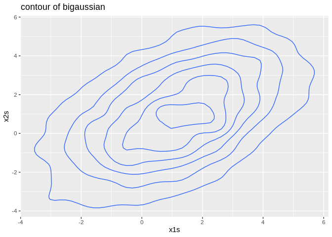
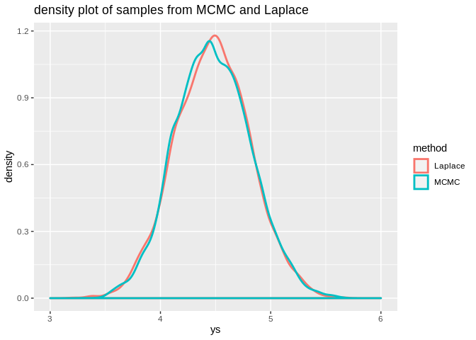

Statisitical Programming - Project 2
================
vanessafun

Due by 11:59 pm on Friday, December 6th.

## Question 1

first,define a density function of bivariate gaussian, then a
random-walk MCMC algorithm is used to simulates observations from this
density. And there’s a contour plot of this bivariate density function
in the bottom.

``` r
library(ggplot2)
library(magrittr)
dbigaussian <- function(x1, x2) {
  sigma <- matrix(c(1, 0.5, 0.5, 1), 2, 2)
  u <- c(1, 1)
  return(as.numeric(exp(
    -0.5 * t(c(x1, x2) - u) %*% solve(sigma) %*% (c(x1, x2) - u) / (2 * pi) /
      sqrt(0.75)
  )))
}
n <- 10000 #number of samples to draw
x1s <- numeric(n)
x2s <- numeric(n)
x1s[1] <- 0 #initial value
x2s[1] <- 0 #initial value
for (i in 2:n) {
  x1 <- x1s[i - 1] + rnorm(1, 0, 1)
  x2 <- x2s[i - 1] + rnorm(1, 0, 1)
  a <- dbigaussian(x1, x2) / dbigaussian(x1s[i - 1], x2s[i - 1])
  if (runif(1) < a) {
    x1s[i] <- x1
    x2s[i] <- x2
  } else {
    x1s[i] <- x1s[i - 1]
    x2s[i] <- x2s[i - 1]
  }
}
x1s <- x1s[-(1:100)]
x2s <- x2s[-(1:100)]
df = data.frame(x1s, x2s)
ggplot(df, aes(x = x1s, y = x2s)) +
  geom_density_2d() +
  labs(title = "contour of bigaussian")
```

<!-- -->

## Question 2

### 2.1

The variance of samples is 1.132592, the variance of Student-t(20) is
1.11, they are pretty close,which support the statement that those
samples are genuine draws from the correct Student-t(20) distribution.

``` r
set.seed(2)
dstudentt <- function(y) {
  v <- 20
  return(gamma((v + 1) / 2) / (sqrt(v * pi) * gamma(v / 2)) *
           (1 + (y ^ 2) / v) ^ (-(v + 1) / 2))
}
n <- 10000 #number of samples to draw
ys <- numeric(n)
ys[1] <- 0 #initial value
for (i in 2:n) {
  y <- ys[i - 1] + rnorm(1, 0, 1)
  a <- dstudentt(y) / dstudentt(ys[i - 1])
  if (runif(1) < a) {
    ys[i] <- y
  } else {
    ys[i] <- ys[i - 1]
  }
}
ys <- ys[-(1:100)]
print(var(ys))#variance of sample
```

    ## [1] 1.132592

``` r
print(20 / 18)#variance of Student-t(20)
```

    ## [1] 1.111111

### 2.2

the sample variance(which is 2.758434) is not close nor equal to
student-t(3) theoretical variance(which is 3), one possible explanation
is that this MCMC’s convergence(statinary distribution) is not
Student-t(3). Another explanation is that stationary dosen’t happen
before the 10000th sample or happened really late, for example, untill
the 7000th sample this MCMC converged, in this situation,the burn-in
B(which is 100) is too small.

``` r
set.seed(2)
dstudentt <- function(y) {
  v <- 3
  return(gamma((v + 1) / 2) / (sqrt(v * pi) * gamma(v / 2)) *
           (1 + (y ^ 2) / v) ^ (-(v + 1) / 2))
}
n <- 10000 #number of samples to draw
ys <- numeric(n)
ys[1] <- 0 #initial value
for (i in 2:n) {
  y <- ys[i - 1] + rnorm(1, 0, 1)
  a <-min(1, dstudentt(y) / dstudentt(ys[i - 1]))#implement matropolis hastings method
  if (runif(1) < a) {
    ys[i] <- y
  } else {
    ys[i] <- ys[i - 1]
  }
}
ys <- ys[-(1:100)]
print(var(ys))#variance of sample
```

    ## [1] 2.758434

``` r
print(3 / 1)#variance of Student-t(3)
```

    ## [1] 3

## Question 3

``` r
y = scan("data/eventtimes.csv", sep=",")
```

### 3.1

define the loglikelihood function

``` r
loglikeli <- function(k){
  n <- 100
  lambda <- 2
  sumup1 <- 0
  for (i in 1:n){
    sumup1 <- sumup1 + (y[i]^k)
  }#calculate the sum of yi with power of k
  sumup2 <- 0
  for (j in 1:n){
    sumup2 <- sumup2 + log(y[j])
  }#calculate the sum of ln(yi) 
  return(
    n*log(k) + (k-1)*sumup2 - (sumup1/lambda^k) - (n*k*log(lambda))#the expression of log likelyhood function of weibull distribution
  )
}
```

### 3.2

Use optim(), found the maximum of loglikelihood function is reached when
k equals to 4.588589, which means the most likelihood estimator of k is
4.588589

``` r
optim(1,loglikeli,control = list(fnscale = -1),method = "CG")
```

    ## $par
    ## [1] 4.588589
    ## 
    ## $value
    ## [1] -60.75909
    ## 
    ## $counts
    ## function gradient 
    ##       29       10 
    ## 
    ## $convergence
    ## [1] 0
    ## 
    ## $message
    ## NULL

### 3.3

The probability of there being more than 1.5 weeks until the next time
that rain occurs is 0.7656637

``` r
pweibull(1.5,4.59,2,lower.tail = FALSE)
```

    ## [1] 0.7656637

### 3.4

Define the posterior function by multiply the likelihood and prior first
and then logrithmn them all.

``` r
dposte <- function(k) {
  alpha <- 1
  beta <- 1
  if (k <= 0) {
    return(-10000)
  }
  return(log((
    beta ^ alpha / gamma(alpha) * k ^ (alpha - 1) * exp(-beta * k)) *exp(loglikeli(k))))
}
```

### 3.5

The mean of Matropolis-Hasting is 4.476628,which is pretty close to the
MLE, the median is 4.462002, and the standard deviation is 0.3381027

``` r
set.seed(200)
n <- 10000 #number of samples to draw
ys1 <- numeric(n)
ys1[1] <- 1 #initial value
for (i in 2:n) {
  newy <- ys1[i - 1] + rnorm(1, 0, 1)
  a <-min(1, exp(dposte(newy)) / exp(dposte(ys1[i - 1])))#implement MP MCMC method
  if (runif(1) < a) {
    ys1[i] <- newy
  } else {
    ys1[i] <- ys1[i - 1]
  }
}
ys1complete <- ys1#preserve 10000 values to draw a plot in 3.7
ys1 <- ys1[-(1:100)]
mean(ys1)
```

    ## [1] 4.476628

``` r
median(ys1)
```

    ## [1] 4.462002

``` r
sd(ys1)
```

    ## [1] 0.3381027

### 3.6

First, I calculate the corresponding probability based on 10000
sampleling values in 3.5,then I calculate the standard deviation of
those 10000 prediction probabilities.

``` r
p <- numeric(length(ys1))
for (i in 1:length(ys1)) {
  p[i] <- pweibull(1.5, ys1[i], 2, lower.tail = FALSE)
}
sd(p)
```

    ## [1] 0.02032476

### 3.7

According to the Laplace approximation , I approximated the posterior
distribution by a normal distribution N(khat,sigma^2)and generated 10000
samples from this distribution,khat is the value which maximise the
posterior,sigma^2 equals to 1 divided by the negtive second derivative
of the log-posterior evaluated at khat

``` r
optim(1,dposte,control = list(fnscale = -1),,method = "CG",hessian = TRUE)
```

    ## $par
    ## [1] 4.470924
    ## 
    ## $value
    ## [1] -65.2886
    ## 
    ## $counts
    ## function gradient 
    ##       29       10 
    ## 
    ## $convergence
    ## [1] 0
    ## 
    ## $message
    ## NULL
    ## 
    ## $hessian
    ##           [,1]
    ## [1,] -8.608074

``` r
khat = 4.470924
sigma2 = -1/-8.608074
ys2 <- rnorm(10000,mean = khat,sd = sqrt(sigma2))
```

### 3.8

Here’re samples density plots of MCMC (in green) and Laplace(in red).

``` r
library(ggplot2)
#create a dataframe that combine samples from MCMC and Laplace approximation
ys1complete =  data.frame(ys = ys1complete)
ys1complete$method <- "MCMC"
ys2 = data.frame(ys = ys2)
ys2$method <- "Laplace"
df = rbind(ys1complete, ys2)
#draw the desity plot
ggplot(df, aes(ys, color = method)) +
  geom_density(size = 1) +
  xlim(3, 6) +
  labs(title = "density plot of samples from MCMC and Laplace")
```

    ## Warning: Removed 7 rows containing non-finite values (stat_density).

<!-- -->
